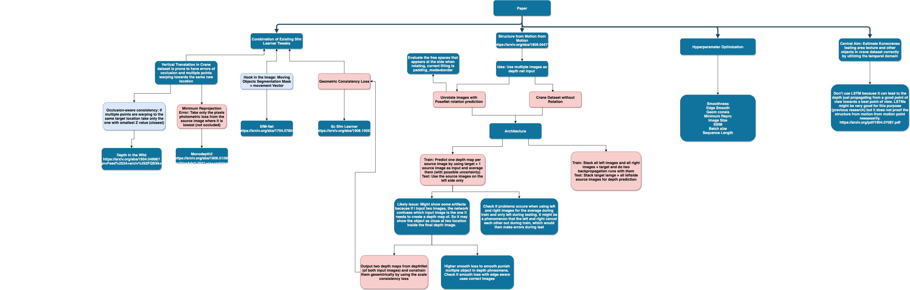

https://www.overleaf.com/project/60ec2c6d3a723a48191dbbdc

Abstract

Self supervised joint depth-pose learning approaches, commonly referred to as \textit{Structure from Motion} (SfM), have recently gathered a lot of attention as their performances ranks competitively on autonomous navigation benchmarks. During test-time, the monocular depth inference through the neural network is inferring depth from a single image and, thus, through scene structure, rather than through motion. If the scene structure is more complex and less constrained than in i.e. in street navigation, we show by an example of industry vision that the depth estimation from scene structure is inherently erroneous in such settings, and needs the temporal domain to be accounted for.

To tackle the observed challenges we expand on the idea of Pinard et. al. which tried to generate dense depth maps from motion by feeding two consecutive images into the DepthNet which outperformed the basis SfM Learner on a synthethic dataset called StillBox, but underperformed it in the KITTI street dataset. In this work we propose an improved training and testing pipeline that aims at incorporating more available information at train and test time by utilizing more than two frames from a given mini sequence (ie. length of 5).
Furthermore, we introduce an industry vision dataset whose novel viewpoint and scene structure are able to visualize the challenges we address in this paper and measure our efforts of overcoming them. Finally, we integrate and finetune a number of methods that target classic visual odometry problems like occlusions and moving objects in the industry dataset to optimize our system's general performance.